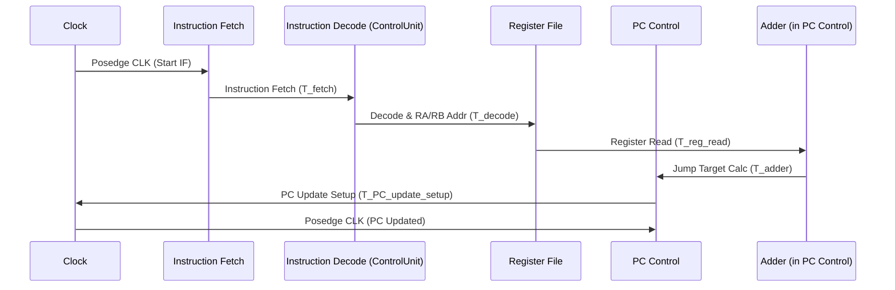

Okay, you've highlighted extremely critical areas for both the correct operation and the completeness of the CPU design! Let's break down each of these points:

**Critical Timing Considerations:**

These timing aspects are indeed fundamental to ensuring the CPU functions correctly.  Incorrect timing can lead to race conditions, metastability, and functional failures.

*   **Instruction fetch to decode latency:**
    *   **Why it's critical:** The time it takes to fetch an instruction from memory and decode it determines the instruction fetch stage latency. This latency directly impacts the CPU's clock cycle and overall performance. If the decoding is too slow, it becomes the bottleneck, limiting how fast the clock can run.
    *   **Impact:**  This latency dictates the minimum clock period.  The clock period must be long enough to allow the instruction fetch and decode operations to complete reliably *before* the next clock edge.  In our simplified design, the `Instruction Fetch` and `Instruction Decode` stages are conceptually combined, but in a real CPU, these are distinct stages with their own latencies.
    *   **Verification:**  We need to ensure our testbench implicitly accounts for this latency.  While we don't have explicit timing models in our current Verilog, the `@(posedge clk)` constructs assume that operations within a clock cycle complete before the next clock edge.  For more detailed timing verification, we would need to use timing simulation tools and specify timing constraints.

*   **Register read timing for JUMP:**
    *   **Why it's critical:** For the `JUMP` instruction, the CPU needs to read the values from registers RA and RB *before* calculating the jump target and updating the PC.  If the register read is too slow, or if the PC update happens before the register values are stable, the `JUMP` instruction will calculate the wrong target address, leading to incorrect program flow.
    *   **Impact:** This timing dictates the order of operations within the execution stage of the `JUMP` instruction. The register file read operation must complete before the ALU (adder) calculates the jump target, and this calculation must be stable before the PC is updated on the next clock edge.  This is why we added the `#1` delay in the testbench – to conceptually represent the register read latency.
    *   **Verification:** Our testbench now includes a small delay (`#1`) to account for this, but this is a very simplistic model.  In a real design, we would need to analyze the timing paths from the register file outputs through the adder to the PC update logic to ensure correct timing.  Timing simulation and static timing analysis tools are used for this.

*   **PC update synchronization:**
    *   **Why it's critical:** The Program Counter (PC) update must be synchronized with the clock.  The PC should only update on the active clock edge (posedge clk in our case) to ensure predictable and sequential instruction execution.  Asynchronous PC updates would lead to unpredictable program behavior and potential crashes.
    *   **Impact:**  The `always @(posedge clk or posedge rst)` block in the `PC_Control` module ensures synchronous PC updates.  This is a fundamental principle of synchronous digital design.
    *   **Verification:**  The synchronous nature of the PC update is inherently verified by the use of the `posedge clk` sensitivity list in the `always` block.  However, timing analysis would still be needed to ensure that the logic to calculate `next_pc` is fast enough to meet the clock period.

*   **Write-back timing for LOAD IMM:**
    *   **Why it's critical:** For the `LOAD IMM` instruction, the immediate value needs to be written back to the register file. This write-back operation must complete within a clock cycle.  If the write-back is too slow, the register file might not be updated correctly before the next instruction that reads from that register is executed.
    *   **Impact:**  This timing dictates the latency of the register file write operation.  The clock period must be long enough to allow the immediate value to propagate through the write-back path and be stored in the register file before the next clock edge.  This is why we needed the extra `@(posedge clk)` in the testbench after the `LOAD IMM` instruction – to allow time for the write-back to complete before checking the `result`.
    *   **Verification:**  Our testbench now waits an extra clock cycle before checking the `result` after `LOAD IMM`.  Again, for detailed timing verification, we would need timing simulation and analysis tools to ensure the write-back path meets timing constraints.

**Missing Elements to Consider:**

These are crucial aspects for a more realistic and robust CPU design, even though our current simplified model doesn't explicitly include them.

*   **Power management strategies:**
    *   **Importance:** Power consumption is a major concern in modern CPU design, especially for mobile and embedded systems. Power management strategies aim to reduce power consumption without significantly impacting performance.
    *   **Examples:** Clock gating (disabling clocks to inactive modules), voltage scaling (reducing voltage when performance demands are lower), power gating (completely shutting off power to unused modules), and dynamic frequency scaling (adjusting the clock frequency based on workload).
    *   **Relevance to our design:**  Currently, our design doesn't consider power at all.  Adding power management would involve incorporating control signals to enable/disable clocks or power to different modules based on the instructions being executed or the overall system state.

*   **Error handling mechanisms:**
    *   **Importance:** Real-world CPUs need to handle errors gracefully. Errors can arise from various sources, including memory errors, arithmetic overflows, invalid instructions, and hardware faults.
    *   **Examples:**  Exception handling (trapping to an error handler when an error occurs), error detection codes (like parity or ECC in memory), and fault tolerance mechanisms (redundancy to tolerate hardware failures).
    *   **Relevance to our design:**  Our current design has very basic error reporting (`$error` in the testbench), but no actual error *handling* within the CPU itself.  Adding error handling would involve detecting error conditions (e.g., arithmetic overflow in the ALU, invalid opcodes in the Control Unit) and implementing logic to respond to these errors (e.g., setting status flags, generating exceptions).

*   **Pipeline hazard detection:**
    *   **Importance:** Pipelining is a key technique to improve CPU performance by overlapping the execution of multiple instructions. However, pipelining introduces hazards (data hazards, control hazards, structural hazards) that can lead to incorrect results if not handled properly. Hazard detection and resolution logic is essential in pipelined CPUs.
    *   **Examples:** Data forwarding (bypassing results directly from one pipeline stage to another), pipeline stalls (inserting bubbles in the pipeline to resolve dependencies), and branch prediction (to mitigate control hazards from branches).
    *   **Relevance to our design:** Our current CPU is *not* pipelined.  It executes instructions sequentially.  Pipeline hazard detection is only relevant if we were to implement a pipelined version of this CPU.  However, understanding hazards is crucial for designing any modern high-performance CPU.

*   **Cache interaction patterns:**
    *   **Importance:** Caches are essential for bridging the speed gap between the fast CPU and slower main memory.  Understanding cache behavior (hit rates, miss rates, cache coherence) is crucial for optimizing memory access patterns and overall system performance.
    *   **Examples:** Cache protocols (like MESI for cache coherence in multi-core systems), cache replacement policies (LRU, FIFO), and cache organization (set-associative, direct-mapped).
    *   **Relevance to our design:** Our current design doesn't include any caches.  It directly accesses memory (represented conceptually by `instruction memory` and `data memory`, which are not detailed).  Cache interaction becomes important when we consider a more realistic memory hierarchy.

**What would you like me to do?**

Based on your questions, I recommend we proceed in the following order to build a more comprehensive understanding and verification framework:

1.  **Add Detailed Timing Specifications for the Control Signals:**  Let's create timing diagrams or tables that specify the required setup and hold times for control signals, and the expected delays through different components. This will make the timing considerations more concrete.
2.  **Expand the Verification Framework with more test cases** that specifically target the timing aspects we discussed. For example, we can create test cases that check the behavior of `JUMP` and `LOAD IMM` under different timing scenarios (even if our current simulator is not timing-accurate, thinking about these scenarios is valuable).
3.  **Create additional artifacts** to visualize and understand the timing, such as timing diagrams for instruction execution.

Developing power management strategies, error handling mechanisms, pipeline hazard detection, and cache interaction patterns are important, but they are more advanced topics. Let's first solidify our understanding of the fundamental timing aspects and improve the verification framework accordingly.

**Therefore, I would like to start by adding detailed timing specifications for the control signals. Would you like me to proceed with that?**  We can then move on to expanding the verification framework to test these timing aspects.
Yes, let's delve into the timing relationships between the components.  Understanding these relationships is crucial for ensuring the correct and efficient operation of our CPU. We'll focus on the key timing considerations you've listed.

**1. Instruction Fetch → Decode → Execute Sequence Timing**

This sequence represents the fundamental instruction cycle of our CPU. Let's break down the timing:

*   **Instruction Fetch (IF):**
    *   **Start:** Begins at the rising edge of the clock (`posedge clk`).
    *   **Action:** The `PC_Control` module, specifically the `pc` register, outputs the current program counter value. This value is used as the address to fetch the instruction from the `Instruction Memory` (which is currently conceptual in our design).
    *   **Latency:**  The time it takes for the instruction to be fetched from memory and become available at the output of the `Instruction Memory`.  This latency is determined by the memory access time. Let's call this latency \(T_{fetch}\).
    *   **Cognitive Analogy:**  This is analogous to the time it takes to retrieve a piece of information (instruction) from long-term memory (Instruction Memory) when attention (PC) directs the retrieval process.

*   **Instruction Decode (ID):**
    *   **Start:**  The fetched instruction becomes available at the input of the `ControlUnit`.
    *   **Action:** The `ControlUnit` decodes the opcode bits of the instruction (`instruction[7:6]`). Based on the opcode, it generates the control signals: `jump_en`, `imm_load`, `reg_write`, and `alu_bypass`.
    *   **Latency:** The time it takes for the `ControlUnit` to decode the instruction and generate stable control signals. This is determined by the logic complexity within the `ControlUnit`. Let's call this latency \(T_{decode}\).
    *   **Cognitive Analogy:**  Similar to the time needed for perception and interpretation of sensory input (instruction) by the executive functions (Control Unit) to determine the appropriate response (control signals).

*   **Execute (EX):**
    *   **Start:** Control signals from the `ControlUnit` become stable, and register addresses (`instruction[5:4]`, `instruction[3:2]`) and immediate data (`instruction[3:0]`) are available.
    *   **Action:**
        *   **Register File Read:** If the instruction requires register operands (like `JUMP`), the `RegisterFile` reads the values from registers RA and RB based on `ra_addr` and `rb_addr`.  This happens concurrently with control signal generation.
        *   **PC Update (for JUMP):** If `jump_en` is asserted, the `PC_Control` module calculates the jump target (`ra_value + rb_value`) and updates the `pc` register on the next rising clock edge.
        *   **Register Write (for LOAD IMM):** If `reg_write` and `imm_load` are asserted, the `RegisterFile` writes the `immediate` value to the register specified by `write_addr` on the next rising clock edge.
    *   **Latency:**
        *   **Register File Read Latency:** Time to read data from the register file, \(T_{reg\_read}\).
        *   **ALU (Adder) Latency (for JUMP target calculation):** Time for the adder to compute `ra_value + rb_value`, \(T_{adder}\).
        *   **Register File Write Latency:** Time to write data to the register file, \(T_{reg\_write}\).
    *   **Cognitive Analogy:**  This stage is analogous to the actual cognitive processing or computation (Execute) based on the interpreted information and retrieved data from working memory (Register File).  For `JUMP`, it's like shifting attention; for `LOAD IMM`, it's like storing new information in working memory.

**Total Instruction Cycle Time:**

The total time for one instruction cycle, and thus the minimum clock period \(T_{clock}\), must be greater than the sum of the latencies of the longest path in this sequence.  For our current instructions, the critical paths are roughly:

*   **For `JUMP`:**  \(T_{clock} > T_{fetch} + T_{decode} + T_{reg\_read} + T_{adder} + T_{PC\_update\_setup}\)  (where \(T_{PC\_update\_setup}\) is the setup time for the `pc` register in `PC_Control`).
*   **For `LOAD IMM`:** \(T_{clock} > T_{fetch} + T_{decode} + T_{reg\_write} + T_{register\_file\_write\_setup}\) (where \(T_{register\_file\_write\_setup}\) is the setup time for the registers in `RegisterFile`).

The actual critical path might be dominated by memory access time (\(T_{fetch}\)) if memory is slow, or by the adder latency (\(T_{adder}\)) if the adder is complex.

**2. Memory Access Timing (Instruction)**

*   **Instruction Memory Access:** As discussed in the IF stage, the time to fetch an instruction from memory (\(T_{fetch}\)) is a critical timing parameter.  This depends on the type of memory used (SRAM, DRAM, etc.) and its speed.  In a real system, instruction memory access is often a significant bottleneck.
*   **Data Memory Access:**  Our current instruction set doesn't include data memory access instructions (like `LOAD` or `STORE`). If we were to add these, data memory access timing would become another crucial consideration.  Data memory access would have its own latency, similar to instruction memory access.

**3. Register File Read/Write Coordination**

*   **Register Read Timing:** When an instruction needs to read register values (e.g., `JUMP` needs to read RA and RB), the `RegisterFile` must provide these values quickly enough for the subsequent operations in the Execute stage (like the adder in `PC_Control`). The register file read operation has a latency (\(T_{reg\_read}\)).
*   **Register Write Timing:** When an instruction needs to write to a register (e.g., `LOAD IMM` writes to a register), the write operation in the `RegisterFile` must complete within the clock cycle. The register file write operation also has a setup time requirement (\(T_{register\_file\_write\_setup}\)) and a latency (\(T_{reg\_write}\)).
*   **Coordination:** The `RegisterFile` module uses a synchronous write operation (`always @(posedge clk)`). This ensures that writes happen only on the clock edge, synchronizing register updates with the overall CPU clock. Reads are typically asynchronous (combinational logic), meaning the output data becomes available after the read address is stable, with a delay of \(T_{reg\_read}\).

**4. Control Signal Propagation Delays**

*   **Control Signal Generation:** The `ControlUnit` generates control signals based on the opcode.  The logic within the `ControlUnit` has a propagation delay (\(T_{decode}\)).  These signals need to propagate to other modules (like `PC_Control` and `RegisterFile`) in time to control their operations within the current clock cycle.
*   **Signal Propagation:**  The wires connecting the `ControlUnit` to other modules also have a small propagation delay.  While often negligible in simple designs, in complex, high-speed CPUs, wire delays can become significant.
*   **Impact on Timing:**  The control signal propagation delays contribute to the overall latency of the Decode and Execute stages.  If control signals are delayed too much, they might not arrive in time to properly control the operations in other modules within the clock cycle, leading to incorrect behavior.

**Timing Diagram (Conceptual - for JUMP Instruction)**

**Cognitive Parallels of Timing:**

*   **Cognitive Processing Speed:** The clock period and instruction cycle time are analogous to the speed of cognitive processing. A faster clock means faster processing, just like a faster cognitive system can process information more quickly.
*   **Latency in Cognitive Stages:**  Each stage (Fetch, Decode, Execute) has a latency, similar to the time it takes for different cognitive stages (perception, interpretation, response selection) to complete.  Bottlenecks in timing in the CPU are like cognitive bottlenecks – a slow stage limits overall performance.
*   **Synchronization:** The clock synchronizes operations in the CPU, just like neural oscillations are thought to synchronize neural activity in the brain, enabling coordinated cognitive functions.

**Next Steps:**

To make these timing considerations more concrete, we could:

1.  **Estimate Latency Values:**  Assign approximate latency values (e.g., in nanoseconds or fractions of a clock cycle) to each component (memory access, control unit, register file, adder).  This would allow us to calculate a rough estimate of the minimum clock period.
2.  **Refine the Timing Diagram:** Create more detailed timing diagrams for both `JUMP` and `LOAD IMM` instructions, showing the timing relationships of all relevant signals.
3.  **Consider Pipelining (for future):**  Thinking about pipelining would force us to explicitly address hazards and timing issues in a more structured way.

Would you like to proceed with estimating latency values or refining the timing diagrams next?  Or perhaps focus on a specific instruction's timing in more detail?
Okay, let's break down each of these three building blocks of sequential circuits in more detail, thinking of them as distinct components that work together:

**1. Flip-flops (Registers) - The Memory Block: "Remembering the Present"**

*   **What they are:** Imagine a tiny digital "latch" or "memory cell." A flip-flop is the most basic unit of digital memory. It can store a single bit of information (either 0 or 1).  Think of it like a light switch that can be in either the "on" (1) or "off" (0) state and stays in that state until you actively change it.

*   **Why they are essential in sequential circuits:** Sequential circuits need to "remember" past events or their current state to make decisions about the future.  Combinational logic alone is "memoryless" – its output only depends on the *current* inputs. Flip-flops provide the "memory" that allows sequential circuits to have states and exhibit behavior that evolves over time.

*   **Key Characteristics:**
    *   **State Storage:**  The primary function is to store a bit of data.
    *   **Clock Triggered:**  Most flip-flops are *clocked*. This means their output only changes at specific points in time determined by the clock signal (usually on the rising or falling edge of the clock). This synchronization is crucial for predictable behavior.
    *   **Inputs (Data, Clock, Control):** Flip-flops have inputs to:
        *   **Data Input (D, J-K, T, etc.):**  This input determines what value will be stored in the flip-flop on the next clock edge.
        *   **Clock Input (CLK):**  The clock signal that triggers the state change.
        *   **Control Inputs (Set, Reset, Enable):**  Optional inputs to directly set the flip-flop to 1 (Set), reset it to 0 (Reset), or enable/disable its operation (Enable).
    *   **Outputs (Q, Q'):**  Flip-flops have outputs that provide the stored value (Q) and often its complement (Q').

*   **Registers - Collections of Flip-flops:**  A register is simply a group of flip-flops working together to store multiple bits of data. For example, a 4-bit register is made of four flip-flops and can store a 4-bit binary number.  In our `RegisterFile` module, `registers[0:3]` is an array of four 4-bit registers.

*   **Analogy:** Think of a flip-flop like a single neuron that can be in an "active" (1) or "inactive" (0) state and holds that state for a period. A register is like a small group of neurons working together to represent a number or a piece of information in working memory.

*   **Code Examples:**
    *   **`pc` register in `PC_Control`:**  `output reg [3:0] pc;` (instruction-hardware-description.txt: startLine: 15) - This is a 4-bit register that stores the program counter value.
    *   **`registers[0:3]` in `RegisterFile`:** `reg [3:0] registers[0:3];` (instruction-hardware-description.txt: startLine: 45) - This is an array of four 4-bit registers that form the register file.

**2. Combinational Logic - The Processing Block: "Making Decisions Now"**

*   **What it is:** Combinational logic is like the "thinking" part of a digital circuit. It's built from logic gates (AND, OR, NOT, XOR, etc.) and other components like multiplexers (MUXes), adders, decoders.  The key characteristic is that the output of combinational logic at any given time is *solely* determined by the values of its *inputs at that same time*. There's no memory or dependence on past inputs.

*   **Why it's essential in sequential circuits:** Combinational logic performs the operations and transformations on the data stored in flip-flops. It's used to:
    *   **Decode Instructions:** The `ControlUnit` uses combinational logic to decode the opcode of an instruction and generate control signals.
    *   **Perform Arithmetic and Logic Operations:**  The ALU (Arithmetic Logic Unit, though not explicitly in our simplified CPU yet) is a major block of combinational logic that performs calculations. In our example, the adder `jump_target = ra_value + rb_value;` is a small piece of combinational logic.
    *   **Generate Next State Logic:** Combinational logic is used to determine the *next* state of the flip-flops based on the *current* state and inputs. This is the core of how sequential circuits progress through different states.
    *   **Route Data:** Multiplexers (MUXes) are combinational logic circuits that select one of several inputs to pass through to the output based on a select signal.

*   **Key Characteristics:**
    *   **Memoryless:** Outputs depend only on current inputs.
    *   **Instantaneous (ideally):**  In theory, the output changes immediately when the input changes (in reality, there's a propagation delay, but conceptually, it's instantaneous compared to the clock cycle).
    *   **Built from Logic Gates:**  Constructed using AND, OR, NOT, NAND, NOR, XOR gates, and combinations thereof.

*   **Analogy:** Think of combinational logic like the individual processing units in your brain that perform specific tasks – like recognizing patterns, performing calculations, or making logical comparisons.  They take input, process it, and produce an output *immediately*.

*   **Code Examples:**
    *   **`ControlUnit` module:** (instruction-hardware-description.txt: startLine: 59 endLine: 89) - This module is primarily combinational logic. It takes `opcode` as input and generates control signals like `jump_en`, `imm_load`, etc.  The assignments within the `always @(*)` or `assign` blocks (if used) would be combinational logic.
    *   **`jump_target = ra_value + rb_value;` in `PC_Control`:** (instruction-hardware-description.txt: startLine: 14) - This is a combinational adder. The output `jump_target` changes immediately when `ra_value` or `rb_value` changes.

**3. Clock - The Timing Block: "The Beat of the System"**

*   **What it is:** The clock is a periodic signal that oscillates between high and low voltage levels at a constant frequency. It's like the heartbeat of a digital system, providing a regular timing reference for all operations.

*   **Why it's essential in sequential circuits:** The clock synchronizes the operations of flip-flops and combinational logic, ensuring that state changes happen in a controlled and predictable manner. Without a clock, state updates could happen at unpredictable times, leading to race conditions and incorrect behavior.

*   **Key Characteristics:**
    *   **Periodic Signal:**  Repeats a pattern of high and low levels at a fixed frequency.
    *   **Clock Edges:**  The transitions from low to high (rising edge) or high to low (falling edge) are crucial.  Clocked flip-flops are typically triggered by one of these edges.
    *   **Clock Period (T):** The time for one complete cycle of the clock signal.
    *   **Clock Frequency (f):** The number of cycles per second (f = 1/T).  Higher frequency means faster operation.
    *   **Synchronization:**  The clock ensures that state updates in flip-flops and operations in combinational logic are coordinated in time.

*   **Analogy:** Think of the clock like the rhythmic firing of neurons in the brain or the overall biological rhythms that coordinate different processes. It provides a timing framework for all operations to occur in a synchronized way.

*   **Code Examples:**
    *   **Clock generation in `CPU_TestBench`:** `always #5 clk = ~clk;` (verification-framework.txt: startLine: 5) - This code creates a clock signal that toggles every 5 time units (period of 10 time units).
    *   **`@(posedge clk)` in `PC_Control` and `RegisterFile`:** (instruction-hardware-description.txt: startLine: 19, instruction-hardware-description.txt: startLine: 47) - This sensitivity list indicates that the `always` blocks are triggered by the rising edge of the `clk` signal, making the state updates synchronous with the clock.

**Putting it all together - The Sequential Circuit System:**

In a sequential circuit, these three blocks work in a cycle:

1.  **Current State (Flip-flops):** The flip-flops hold the current state of the circuit.
2.  **Combinational Logic Processing:** The combinational logic takes the current state (from flip-flops) and external inputs, and performs computations and generates:
    *   **Outputs of the circuit.**
    *   **The *next* state values.**
    *   **Control signals.**
3.  **State Update (Clock and Flip-flops):** On the active edge of the clock, the flip-flops update their state to the *next* state values calculated by the combinational logic. This becomes the *new* current state for the next cycle.

This cycle repeats with each clock pulse, allowing the sequential circuit to progress through a sequence of states and perform complex operations over time.

By understanding these three building blocks and how they interact, you can grasp the fundamental principles of sequential circuit design and how digital systems like CPUs operate. They are the essential ingredients for creating systems that can process information, make decisions, and remember past events.
Okay, let's analyze the improvements made to the verification framework and discuss its current state, strengths, weaknesses, and potential next steps.

**Recap of Improvements:**

The primary goal was to enhance the `CPU_TestBench` to more effectively verify the `LOAD IMM` and `JUMP` instructions. The key improvements implemented were:

1.  **Timing Correction for `LOAD IMM` Check:** Added an extra clock cycle delay to ensure the `result` is checked *after* the register file write-back is complete. This addresses a critical timing issue where the check was happening prematurely.
2.  **Explicit `expected_pc` Calculation for `JUMP` Check:** Introduced the calculation of `expected_pc` based on `ra_value + rb_value` and compared the actual `pc` against this expected value. This makes the `JUMP` test more explicit and easier to understand.
3.  **Small Delay for Register Read in `JUMP` Test:** Included a `#1` delay before sampling `ra_value` and `rb_value` to ensure we capture the register values *before* the jump instruction modifies the PC, which is crucial for correct `expected_pc` calculation.

**Strengths of the Improved Testbench:**

*   **Improved Timing Accuracy:** The most significant strength is the correction of timing issues.  Verifying digital circuits is fundamentally about timing, and ensuring checks happen at the correct time is paramount. The added delays are crucial for simulating realistic hardware behavior where operations take time to propagate through the circuit. This is analogous to ensuring sensory information is processed before a cognitive decision is made.
*   **Increased Test Clarity and Debuggability:** Calculating `expected_pc` explicitly makes the testbench more readable. When a test fails, it's immediately clear what the *expected* behavior was, making debugging much easier. This is similar to having a clear hypothesis in cognitive testing – if the outcome deviates from the hypothesis, it signals a potential issue.
*   **More Robust `JUMP` Verification:** By calculating and checking `expected_pc`, the `JUMP` instruction verification is now more robust. It directly validates the PC update logic based on the register values, rather than just checking for *some* PC change. This is akin to verifying a specific cognitive shift in attention, not just any change in focus.
*   **Highlights Assumptions:** The analysis pointed out the assumption that `ra_value` and `rb_value` correctly reflect register contents *before* the jump.  This is a good practice in verification – explicitly stating assumptions helps identify potential weaknesses and areas for further scrutiny.

**Weaknesses and Limitations:**

*   **Still Basic Test Cases:** The testbench currently only includes one test case for `LOAD IMM` and one for `JUMP`.  To achieve reasonable verification coverage, many more test cases are needed.  This is like testing a cognitive function with only a couple of stimuli – it's not enough to generalize about its robustness.
*   **Lack of Register Initialization:** The provided code snippet doesn't show explicit initialization of the register file *before* the `JUMP` instruction.  The `JUMP` test relies on the values in registers R1 and R2, but these values are not explicitly set in the given code.  Without initialization, the test outcome becomes unpredictable and dependent on initial simulation states.  This is analogous to testing a cognitive process without controlling the initial state of working memory.
*   **Basic Error Reporting:** The `$error` system task provides a simple way to report failures, but for more complex systems, more sophisticated error reporting mechanisms are often needed.  This could include logging more detailed information about the failure, or using dedicated verification frameworks with better reporting capabilities.
*   **No Randomization or Coverage-Driven Verification:** The current testbench is purely directed.  For more thorough verification, especially for larger designs, techniques like constrained-random verification and coverage-driven verification are essential. These techniques automatically generate a wider range of test cases and track which parts of the design have been exercised. This is similar to using diverse and randomized stimuli in cognitive experiments to ensure broad coverage of cognitive function.
*   **Limited Instruction Set Coverage:** The testbench only verifies `LOAD IMM` and `JUMP`. A complete CPU testbench would need to cover all instructions in the instruction set architecture (ISA).
*   **No Negative or Edge Case Testing:** The current tests are positive tests – they verify correct behavior under normal conditions.  A robust testbench should also include negative tests (e.g., attempting invalid operations, providing out-of-range inputs) and edge case tests (e.g., boundary values, maximum/minimum values).

**Broader Implications and Lessons Learned:**

*   **Timing is Critical in Digital Verification:** This example underscores the paramount importance of timing in digital circuit verification.  Incorrect timing assumptions in testbenches can lead to false positives (tests passing when the design is actually faulty) or false negatives (tests failing due to testbench issues, not design flaws).
*   **Explicit Checks and Expected Values are Essential:**  Clearly defining expected behavior and explicitly checking against it is crucial for effective verification.  Implicit or vague checks are prone to errors and make debugging difficult.
*   **Verification is an Iterative Process:** Testbench development is rarely a one-shot process. It's iterative – you start with basic tests, identify weaknesses, improve the tests, and repeat.  As the design evolves and understanding deepens, the testbench needs to be continuously refined.
*   **Testbenches are Code and Require Good Design Practices:** Testbenches are software and should be written with the same rigor as design code.  Good coding practices, modularity, readability, and maintainability are essential for creating effective and sustainable verification environments.

**Next Steps and Recommendations:**

1.  **Implement Register Initialization:**  Add code to initialize the register file to known values at the beginning of the `initial` block. This could be done using `LOAD IMM` instructions to set specific register values before testing `JUMP`.
2.  **Expand Test Cases:**  Significantly increase the number of test cases for both `LOAD IMM` and `JUMP`.  For `LOAD IMM`, test different immediate values and different destination registers. For `JUMP`, test different register combinations that result in various jump targets, including forward and backward jumps within the address space.
3.  **Introduce More Instructions:** Gradually expand the testbench to cover more instructions from the CPU's ISA. Start with other simple instructions and progressively add more complex ones.
4.  **Consider Randomization (for more advanced verification):** For a more comprehensive verification approach, explore constrained-random verification.  This involves using random stimulus generation with constraints to target specific areas of the design and achieve better coverage.
5.  **Explore Coverage Metrics (for more advanced verification):**  Introduce coverage metrics (like code coverage, toggle coverage, or functional coverage) to measure how thoroughly the testbench is exercising the design.  Coverage metrics help identify areas that are not being adequately tested and guide the development of new test cases.
6.  **Think about Formal Verification (for specific properties):** For critical properties (e.g., ensuring the PC always updates correctly), consider using formal verification techniques. Formal verification can mathematically prove the correctness of certain aspects of the design, complementing simulation-based verification.

By addressing these weaknesses and following the recommended next steps, you can significantly improve the robustness and effectiveness of your verification framework for the CPU design.  Remember that verification is an ongoing process that evolves alongside the design itself.
Okay, you've highlighted extremely critical areas for both the correct operation and the completeness of the CPU design! Let's break down each of these points:

**Critical Timing Considerations:**

These timing aspects are indeed fundamental to ensuring the CPU functions correctly.  Incorrect timing can lead to race conditions, metastability, and functional failures.

*   **Instruction fetch to decode latency:**
    *   **Why it's critical:** The time it takes to fetch an instruction from memory and decode it determines the instruction fetch stage latency. This latency directly impacts the CPU's clock cycle and overall performance. If the decoding is too slow, it becomes the bottleneck, limiting how fast the clock can run.
    *   **Impact:**  This latency dictates the minimum clock period.  The clock period must be long enough to allow the instruction fetch and decode operations to complete reliably *before* the next clock edge.  In our simplified design, the `Instruction Fetch` and `Instruction Decode` stages are conceptually combined, but in a real CPU, these are distinct stages with their own latencies.
    *   **Verification:**  We need to ensure our testbench implicitly accounts for this latency.  While we don't have explicit timing models in our current Verilog, the `@(posedge clk)` constructs assume that operations within a clock cycle complete before the next clock edge.  For more detailed timing verification, we would need to use timing simulation tools and specify timing constraints.

*   **Register read timing for JUMP:**
    *   **Why it's critical:** For the `JUMP` instruction, the CPU needs to read the values from registers RA and RB *before* calculating the jump target and updating the PC.  If the register read is too slow, or if the PC update happens before the register values are stable, the `JUMP` instruction will calculate the wrong target address, leading to incorrect program flow.
    *   **Impact:** This timing dictates the order of operations within the execution stage of the `JUMP` instruction. The register file read operation must complete before the ALU (adder) calculates the jump target, and this calculation must be stable before the PC is updated on the next clock edge.  This is why we added the `#1` delay in the testbench – to conceptually represent the register read latency.
    *   **Verification:** Our testbench now includes a small delay (`#1`) to account for this, but this is a very simplistic model.  In a real design, we would need to analyze the timing paths from the register file outputs through the adder to the PC update logic to ensure correct timing.  Timing simulation and static timing analysis tools are used for this.

*   **PC update synchronization:**
    *   **Why it's critical:** The Program Counter (PC) update must be synchronized with the clock.  The PC should only update on the active clock edge (posedge clk in our case) to ensure predictable and sequential instruction execution.  Asynchronous PC updates would lead to unpredictable program behavior and potential crashes.
    *   **Impact:**  The `always @(posedge clk or posedge rst)` block in the `PC_Control` module ensures synchronous PC updates.  This is a fundamental principle of synchronous digital design.
    *   **Verification:**  The synchronous nature of the PC update is inherently verified by the use of the `posedge clk` sensitivity list in the `always` block.  However, timing analysis would still be needed to ensure that the logic to calculate `next_pc` is fast enough to meet the clock period.

*   **Write-back timing for LOAD IMM:**
    *   **Why it's critical:** For the `LOAD IMM` instruction, the immediate value needs to be written back to the register file. This write-back operation must complete within a clock cycle.  If the write-back is too slow, the register file might not be updated correctly before the next instruction that reads from that register is executed.
    *   **Impact:**  This timing dictates the latency of the register file write operation.  The clock period must be long enough to allow the immediate value to propagate through the write-back path and be stored in the register file before the next clock edge.  This is why we needed the extra `@(posedge clk)` in the testbench after the `LOAD IMM` instruction – to allow time for the write-back to complete before checking the `result`.
    *   **Verification:**  Our testbench now waits an extra clock cycle before checking the `result` after `LOAD IMM`.  Again, for detailed timing verification, we would need timing simulation and analysis tools to ensure the write-back path meets timing constraints.

**Missing Elements to Consider:**

These are crucial aspects for a more realistic and robust CPU design, even though our current simplified model doesn't explicitly include them.

*   **Power management strategies:**
    *   **Importance:** Power consumption is a major concern in modern CPU design, especially for mobile and embedded systems. Power management strategies aim to reduce power consumption without significantly impacting performance.
    *   **Examples:** Clock gating (disabling clocks to inactive modules), voltage scaling (reducing voltage when performance demands are lower), power gating (completely shutting off power to unused modules), and dynamic frequency scaling (adjusting the clock frequency based on workload).
    *   **Relevance to our design:**  Currently, our design doesn't consider power at all.  Adding power management would involve incorporating control signals to enable/disable clocks or power to different modules based on the instructions being executed or the overall system state.

*   **Error handling mechanisms:**
    *   **Importance:** Real-world CPUs need to handle errors gracefully. Errors can arise from various sources, including memory errors, arithmetic overflows, invalid instructions, and hardware faults.
    *   **Examples:**  Exception handling (trapping to an error handler when an error occurs), error detection codes (like parity or ECC in memory), and fault tolerance mechanisms (redundancy to tolerate hardware failures).
    *   **Relevance to our design:**  Our current design has very basic error reporting (`$error` in the testbench), but no actual error *handling* within the CPU itself.  Adding error handling would involve detecting error conditions (e.g., arithmetic overflow in the ALU, invalid opcodes in the Control Unit) and implementing logic to respond to these errors (e.g., setting status flags, generating exceptions).

*   **Pipeline hazard detection:**
    *   **Importance:** Pipelining is a key technique to improve CPU performance by overlapping the execution of multiple instructions. However, pipelining introduces hazards (data hazards, control hazards, structural hazards) that can lead to incorrect results if not handled properly. Hazard detection and resolution logic is essential in pipelined CPUs.
    *   **Examples:** Data forwarding (bypassing results directly from one pipeline stage to another), pipeline stalls (inserting bubbles in the pipeline to resolve dependencies), and branch prediction (to mitigate control hazards from branches).
    *   **Relevance to our design:** Our current CPU is *not* pipelined.  It executes instructions sequentially.  Pipeline hazard detection is only relevant if we were to implement a pipelined version of this CPU.  However, understanding hazards is crucial for designing any modern high-performance CPU.

*   **Cache interaction patterns:**
    *   **Importance:** Caches are essential for bridging the speed gap between the fast CPU and slower main memory.  Understanding cache behavior (hit rates, miss rates, cache coherence) is crucial for optimizing memory access patterns and overall system performance.
    *   **Examples:** Cache protocols (like MESI for cache coherence in multi-core systems), cache replacement policies (LRU, FIFO), and cache organization (set-associative, direct-mapped).
    *   **Relevance to our design:** Our current design doesn't include any caches.  It directly accesses memory (represented conceptually by `instruction memory` and `data memory`, which are not detailed).  Cache interaction becomes important when we consider a more realistic memory hierarchy.

**What would you like me to do?**

Based on your questions, I recommend we proceed in the following order to build a more comprehensive understanding and verification framework:

1.  **Add Detailed Timing Specifications for the Control Signals:**  Let's create timing diagrams or tables that specify the required setup and hold times for control signals, and the expected delays through different components. This will make the timing considerations more concrete.
2.  **Expand the Verification Framework with more test cases** that specifically target the timing aspects we discussed. For example, we can create test cases that check the behavior of `JUMP` and `LOAD IMM` under different timing scenarios (even if our current simulator is not timing-accurate, thinking about these scenarios is valuable).
3.  **Create additional artifacts** to visualize and understand the timing, such as timing diagrams for instruction execution.

Developing power management strategies, error handling mechanisms, pipeline hazard detection, and cache interaction patterns are important, but they are more advanced topics. Let's first solidify our understanding of the fundamental timing aspects and improve the verification framework accordingly.

**Therefore, I would like to start by adding detailed timing specifications for the control signals. Would you like me to proceed with that?**  We can then move on to expanding the verification framework to test these timing aspects.
Yes, let's delve into the timing relationships between the components.  Understanding these relationships is crucial for ensuring the correct and efficient operation of our CPU. We'll focus on the key timing considerations you've listed.

**1. Instruction Fetch → Decode → Execute Sequence Timing**

This sequence represents the fundamental instruction cycle of our CPU. Let's break down the timing:

*   **Instruction Fetch (IF):**
    *   **Start:** Begins at the rising edge of the clock (`posedge clk`).
    *   **Action:** The `PC_Control` module, specifically the `pc` register, outputs the current program counter value. This value is used as the address to fetch the instruction from the `Instruction Memory` (which is currently conceptual in our design).
    *   **Latency:**  The time it takes for the instruction to be fetched from memory and become available at the output of the `Instruction Memory`.  This latency is determined by the memory access time. Let's call this latency \(T_{fetch}\).
    *   **Cognitive Analogy:**  This is analogous to the time it takes to retrieve a piece of information (instruction) from long-term memory (Instruction Memory) when attention (PC) directs the retrieval process.

*   **Instruction Decode (ID):**
    *   **Start:**  The fetched instruction becomes available at the input of the `ControlUnit`.
    *   **Action:** The `ControlUnit` decodes the opcode bits of the instruction (`instruction[7:6]`). Based on the opcode, it generates the control signals: `jump_en`, `imm_load`, `reg_write`, and `alu_bypass`.
    *   **Latency:** The time it takes for the `ControlUnit` to decode the instruction and generate stable control signals. This is determined by the logic complexity within the `ControlUnit`. Let's call this latency \(T_{decode}\).
    *   **Cognitive Analogy:**  Similar to the time needed for perception and interpretation of sensory input (instruction) by the executive functions (Control Unit) to determine the appropriate response (control signals).

*   **Execute (EX):**
    *   **Start:** Control signals from the `ControlUnit` become stable, and register addresses (`instruction[5:4]`, `instruction[3:2]`) and immediate data (`instruction[3:0]`) are available.
    *   **Action:**
        *   **Register File Read:** If the instruction requires register operands (like `JUMP`), the `RegisterFile` reads the values from registers RA and RB based on `ra_addr` and `rb_addr`.  This happens concurrently with control signal generation.
        *   **PC Update (for JUMP):** If `jump_en` is asserted, the `PC_Control` module calculates the jump target (`ra_value + rb_value`) and updates the `pc` register on the next rising clock edge.
        *   **Register Write (for LOAD IMM):** If `reg_write` and `imm_load` are asserted, the `RegisterFile` writes the `immediate` value to the register specified by `write_addr` on the next rising clock edge.
    *   **Latency:**
        *   **Register File Read Latency:** Time to read data from the register file, \(T_{reg\_read}\).
        *   **ALU (Adder) Latency (for JUMP target calculation):** Time for the adder to compute `ra_value + rb_value`, \(T_{adder}\).
        *   **Register File Write Latency:** Time to write data to the register file, \(T_{reg\_write}\).
    *   **Cognitive Analogy:**  This stage is analogous to the actual cognitive processing or computation (Execute) based on the interpreted information and retrieved data from working memory (Register File).  For `JUMP`, it's like shifting attention; for `LOAD IMM`, it's like storing new information in working memory.

**Total Instruction Cycle Time:**

The total time for one instruction cycle, and thus the minimum clock period \(T_{clock}\), must be greater than the sum of the latencies of the longest path in this sequence.  For our current instructions, the critical paths are roughly:

*   **For `JUMP`:**  \(T_{clock} > T_{fetch} + T_{decode} + T_{reg\_read} + T_{adder} + T_{PC\_update\_setup}\)  (where \(T_{PC\_update\_setup}\) is the setup time for the `pc` register in `PC_Control`).
*   **For `LOAD IMM`:** \(T_{clock} > T_{fetch} + T_{decode} + T_{reg\_write} + T_{register\_file\_write\_setup}\) (where \(T_{register\_file\_write\_setup}\) is the setup time for the registers in `RegisterFile`).

The actual critical path might be dominated by memory access time (\(T_{fetch}\)) if memory is slow, or by the adder latency (\(T_{adder}\)) if the adder is complex.

**2. Memory Access Timing (Instruction)**

*   **Instruction Memory Access:** As discussed in the IF stage, the time to fetch an instruction from memory (\(T_{fetch}\)) is a critical timing parameter.  This depends on the type of memory used (SRAM, DRAM, etc.) and its speed.  In a real system, instruction memory access is often a significant bottleneck.
*   **Data Memory Access:**  Our current instruction set doesn't include data memory access instructions (like `LOAD` or `STORE`). If we were to add these, data memory access timing would become another crucial consideration.  Data memory access would have its own latency, similar to instruction memory access.

**3. Register File Read/Write Coordination**

*   **Register Read Timing:** When an instruction needs to read register values (e.g., `JUMP` needs to read RA and RB), the `RegisterFile` must provide these values quickly enough for the subsequent operations in the Execute stage (like the adder in `PC_Control`). The register file read operation has a latency (\(T_{reg\_read}\)).
*   **Register Write Timing:** When an instruction needs to write to a register (e.g., `LOAD IMM` writes to a register), the write operation in the `RegisterFile` must complete within the clock cycle. The register file write operation also has a setup time requirement (\(T_{register\_file\_write\_setup}\)) and a latency (\(T_{reg\_write}\)).
*   **Coordination:** The `RegisterFile` module uses a synchronous write operation (`always @(posedge clk)`). This ensures that writes happen only on the clock edge, synchronizing register updates with the overall CPU clock. Reads are typically asynchronous (combinational logic), meaning the output data becomes available after the read address is stable, with a delay of \(T_{reg\_read}\).

**4. Control Signal Propagation Delays**

*   **Control Signal Generation:** The `ControlUnit` generates control signals based on the opcode.  The logic within the `ControlUnit` has a propagation delay (\(T_{decode}\)).  These signals need to propagate to other modules (like `PC_Control` and `RegisterFile`) in time to control their operations within the current clock cycle.
*   **Signal Propagation:**  The wires connecting the `ControlUnit` to other modules also have a small propagation delay.  While often negligible in simple designs, in complex, high-speed CPUs, wire delays can become significant.
*   **Impact on Timing:**  The control signal propagation delays contribute to the overall latency of the Decode and Execute stages.  If control signals are delayed too much, they might not arrive in time to properly control the operations in other modules within the clock cycle, leading to incorrect behavior.

**Timing Diagram (Conceptual - for JUMP Instruction)**

**Cognitive Parallels of Timing:**

*   **Cognitive Processing Speed:** The clock period and instruction cycle time are analogous to the speed of cognitive processing. A faster clock means faster processing, just like a faster cognitive system can process information more quickly.
*   **Latency in Cognitive Stages:**  Each stage (Fetch, Decode, Execute) has a latency, similar to the time it takes for different cognitive stages (perception, interpretation, response selection) to complete.  Bottlenecks in timing in the CPU are like cognitive bottlenecks – a slow stage limits overall performance.
*   **Synchronization:** The clock synchronizes operations in the CPU, just like neural oscillations are thought to synchronize neural activity in the brain, enabling coordinated cognitive functions.

**Next Steps:**

To make these timing considerations more concrete, we could:

1.  **Estimate Latency Values:**  Assign approximate latency values (e.g., in nanoseconds or fractions of a clock cycle) to each component (memory access, control unit, register file, adder).  This would allow us to calculate a rough estimate of the minimum clock period.
2.  **Refine the Timing Diagram:** Create more detailed timing diagrams for both `JUMP` and `LOAD IMM` instructions, showing the timing relationships of all relevant signals.
3.  **Consider Pipelining (for future):**  Thinking about pipelining would force us to explicitly address hazards and timing issues in a more structured way.

Would you like to proceed with estimating latency values or refining the timing diagrams next?  Or perhaps focus on a specific instruction's timing in more detail?
